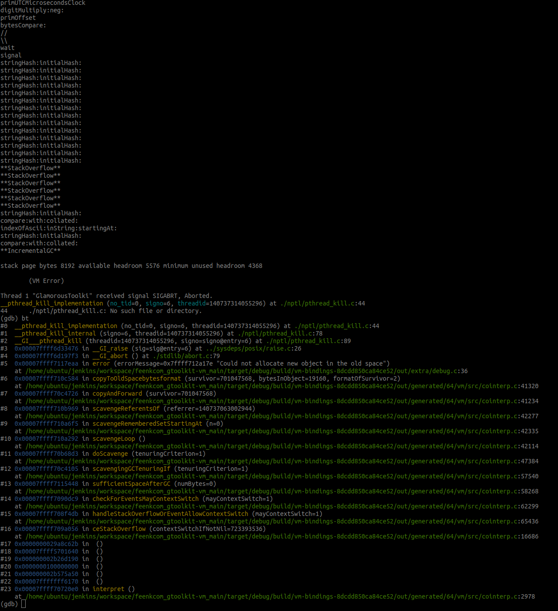

# Remote Runner crashes under load

## Experiment setup
We start a Remote Runner by executing `runner.st` script. The script initializes a `GtRemoteRunner` and submits a significant amount of tasks to the runner as a composite job.  Then we launch `N` workers that get tasks from the runner one at a time and simulate the execution returning a hardcoded result.

## Windows

### Previously observed crashes

<details>
    <summary>Silent crash with no stack trace dump nor error log</summary>
    Under socket load we observed strange crashes with no trace. The crashes are more frequent in an interactive mode. However, we also observed mysterious silent crashes in non-interactive mode. The running hypothesis is that Winit's OS event handling interferes with those of sockets.
</details>

### Reproducing crashes

### Interactive

```powershell
.\bin\GlamorousToolkit-cli.exe GlamorousToolkit.image --interactive st runner.st
```

### Headless

Start Remote Runner:
```powershell
.\bin\GlamorousToolkit-cli.exe GlamorousToolkit.image st runner.st
```
Launch `500` workers (intended to be executed multiple times):
```bash
.\start-rust-worker.ps1
```

## Linux

### Previously observed crashes

<details>
  <summary>Headless Remote Runner crashes in <code>aioPoll</code></summary>

```
PharoVM version:5.0-Pharo 9.0.13 built on Jul 10 2022 21:19:37 Compiler: 4.2.1 Compatible Clang 6.0.0 (tags/RELEASE_600/final) 4.2.1 Compatible Clang 6.0.0 (tags/RELEASE_600/final) [Production Spur 64-bit VM]
Built from: CoInterpreter * VMMaker-tonel.1 uuid: dca5e3af-db9f-0d00-8579-c0b10d9d0195 Jul 10 2022
With:StackToRegisterMappingCogit * VMMaker-tonel.1 uuid: dca5e3af-db9f-0d00-8579-c0b10d9d0195 Jul 10 2022
Revision: v9.0.13-4-ge0b19ce - Commit: e0b19ce - Date: 2022-03-30 09:53:45 +02:00

C stack backtrace & registers:
rax 0x7fb0eee02c50 rbx 0x00000000 rcx 0x7fb0f100e280 rdx 0x00000004
rdi 0x00000000 rsi 0x00000000 rbp 0x00000004 rsp 0x7ffebb99ee70
r8  0x7fb0f0d53e31 r9  0x00000000 r10 0x7ffebb99ef60 r11 0x00000000
r12 0x7fb0f0d4a170 r13 0x7fb0f1012280 r14 0x00000000 r15 0x00000001
rip 0x7fb0eee02c64
*/home/ubuntu/gt/bin/../lib/../lib/libSocketPlugin.so(+0x9c64)[0x7fb0eee02c64]
/home/ubuntu/gt/bin/../lib/libPharoVMCore.so(reportStackState+0x11e)[0x7fb0f0d4a53e]
/home/ubuntu/gt/bin/../lib/libPharoVMCore.so(doReport+0xa5)[0x7fb0f0d4a405]
/home/ubuntu/gt/bin/../lib/libPharoVMCore.so(sigsegv+0x14)[0x7fb0f0d4a784]
/lib/x86_64-linux-gnu/libpthread.so.0(+0x14420)[0x7fb0f0c32420]
/home/ubuntu/gt/bin/../lib/../lib/libSocketPlugin.so(+0x9c64)[0x7fb0eee02c64]
/home/ubuntu/gt/bin/../lib/libPharoVMCore.so(aioPoll+0x4de)[0x7fb0f0d49e9e]
/home/ubuntu/gt/bin/../lib/libPharoVMCore.so(ioRelinquishProcessorForMicroseconds+0x34)[0x7fb0f0d463c4]
/home/ubuntu/gt/bin/../lib/libPharoVMCore.so(+0xbc683)[0x7fb0f0d2a683]
[0x1d0efa0ef]
[0x0]

Most recent primitives
write:from:startingAt:count:
write:from:startingAt:count:
write:from:startingAt:count:
write:from:startingAt:count:
write:from:startingAt:count:
write:from:startingAt:count:
write:from:startingAt:count:
write:from:startingAt:count:
write:from:startingAt:count:
write:from:startingAt:count:
write:from:startingAt:count:
write:from:startingAt:count:
write:from:startingAt:count:
write:from:startingAt:count:
write:from:startingAt:count:
  ```
</details>

### Reproducing crashes

We compiled a `gtoolkit-vm` with debug symbols and used `gdb` to debug.

Start Remote Runner:
```bash
./bin/GlamorousToolkit-cli GlamorousToolkit.image st runner.st
```
Launch `500` workers (intended to be executed multiple times):
```bash
./start-rust-worker.sh
```

### Crash in `aioPoll`

Under heavy load with ~1000 workers the VM was consistently crashing with a similar stack trace as in the previously observed crashes. 

The crash and a possible fix is documented in the following issue:
[https://github.com/pharo-project/pharo/issues/11796](https://github.com/pharo-project/pharo/issues/11796)

### New crash when trying to allocate new object in the old space


To be investigated...

## Mac

We haven't experienced socket related crashes yet.